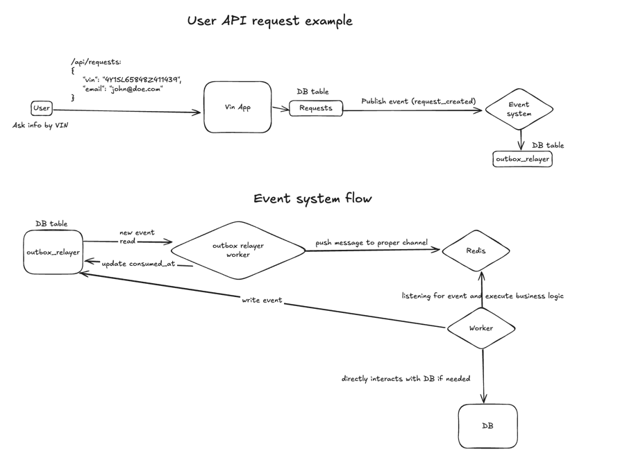

### What am I looking at?
This is a pet project which demonstrates "Get car info by VIN" service implementation on the Python stack (FastApi, PostgreSQL, Celery).
Architecture might have some overengineering for such a small project, but it's for better scalability if one day I get a seed round from Y Combinator 😎

### 🏎️  What is VIN about?
VIN is a unique car identifier you can use to search your car history-damages, theft, number of previous owners, etc.
Limited information is mostly available on government sites and on car marketplaces, like autoscout24.nl or marktplaats.nl.
More detailed-rich info is available on some paid services which allow you to get full car history over past years, though this information is usually behind a paywall.

### What is this pet project for?
This pet project is mocking the paid service described above. It does not search for real car history (yet) and just generates random data for incoming requests.
It's more a technical demonstration rather than a production-ready service (yet).

### Technical architecture
It's a monolithic application with PostgreSQL as DBMS, Redis as event broker. Everything inside docker.

### How to set up

Just run `make init`, which:
* Build container
* Run containers
* Apply migrations

### How to run api
* For Jetbrains IDE see test_main.http

### Containers structure:
* **api** - monolith backend application
* **worker** - celery worker (all tasks under one roof)
* **redis** - used as message broker in addition to message outbox pattern
* postgres - DB

### Tables structure:
* **alembic_version** - migrations
* **cars** - overall list of VINs with car details
* **requests** - incoming user's requests to find car info by VIN
* **outbox_relayer** - storage for message outbox pattern for event system

### TBD:
* Redis Lists as message broker. No ack for consumer. Now used for simplicity, should be replace for RabbitMQ (for ex.)
* Monolithic architecture chosen for simplicity, might be split to microservices
* Improve event system code
* Improve logging and alerting
* RBAC
* Tests
